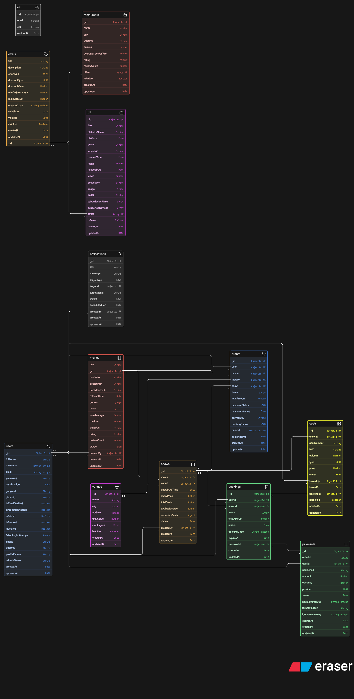
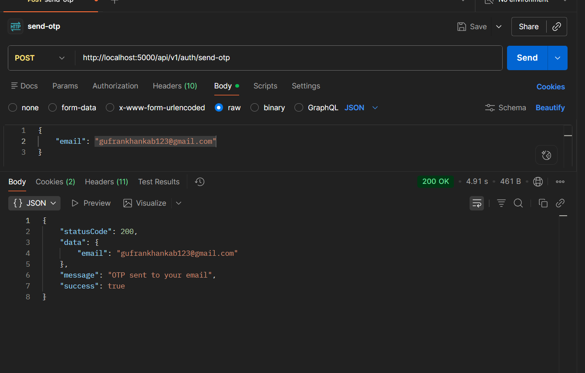
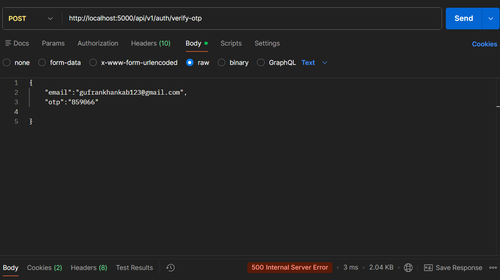
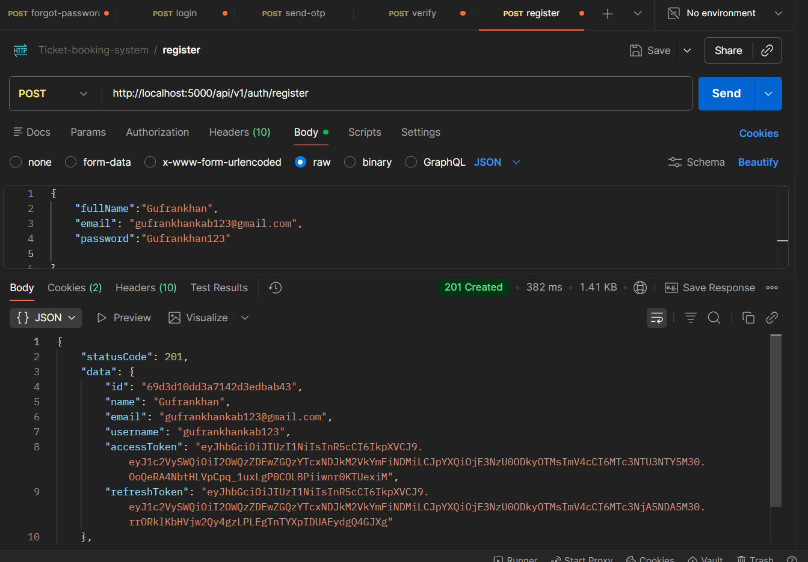
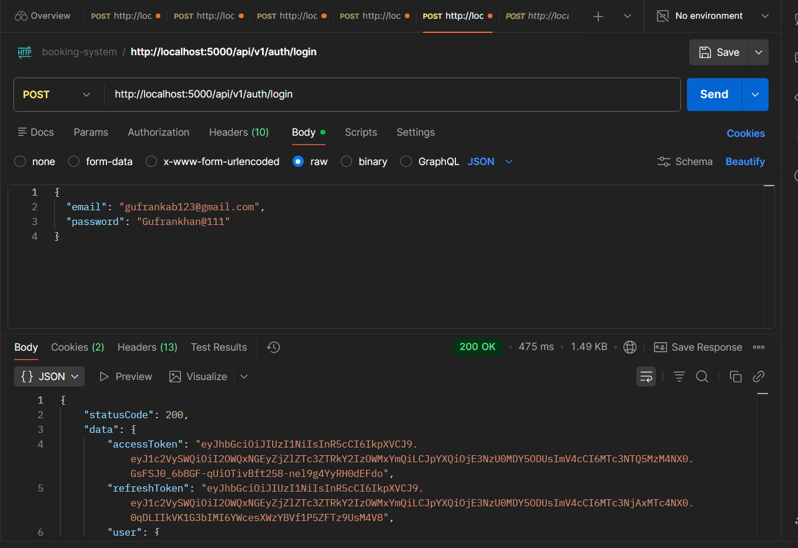
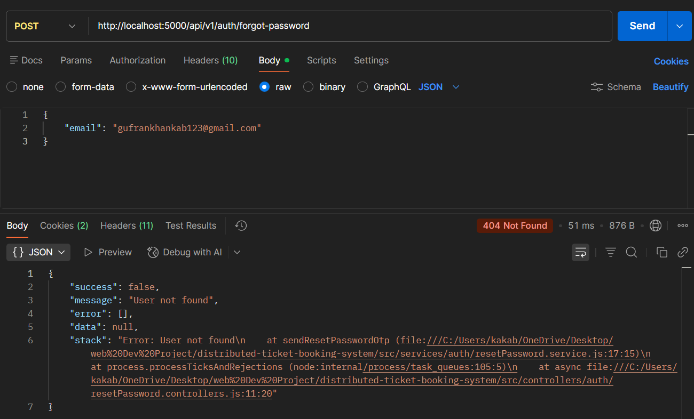
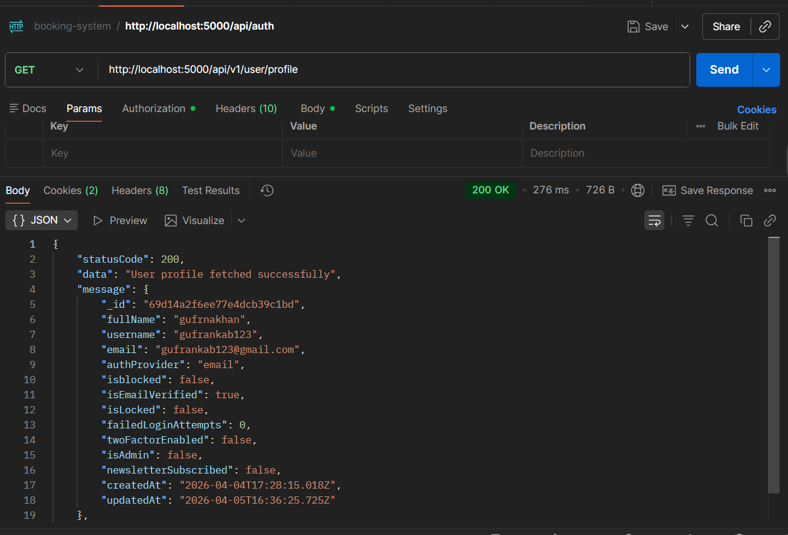
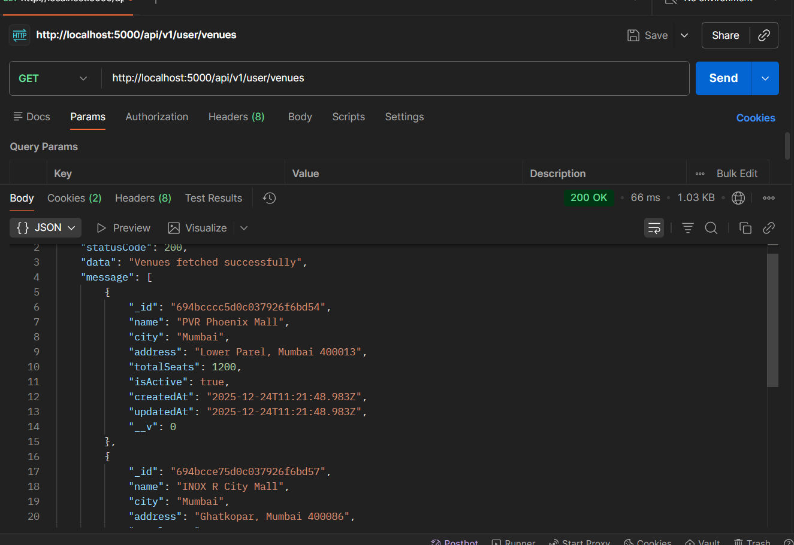
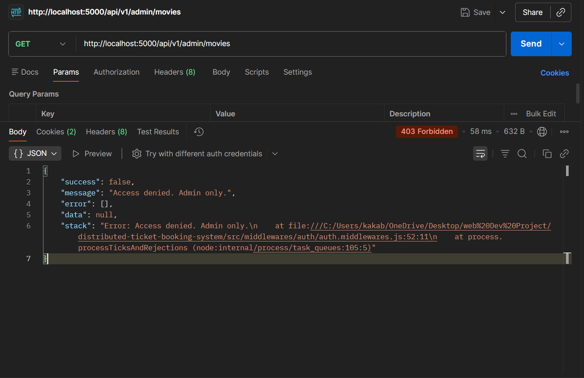

# 🎬✨ Distributed Ticket Booking System
<p align="center">
   <a href="https://distributed-ticket-booking-system-1.onrender.com" target="_blank">
      
   </a>
</p>

<p align="center">
   <b>🌐 <a href="https://distributed-ticket-booking-system-1.onrender.com" target="_blank">View the API Live on Render</a></b>
</p>


---

A modern, production-ready backend API for movie ticket booking. Enjoy real-time seat locking, async payment processing, admin dashboards, and user notifications—all built for reliability, scalability, and a great developer experience.

---

## 🌟 All Features at a Glance

- 🔐 **Authentication**: JWT, OAuth (Google/GitHub), 2FA (OTP/TOTP), password reset, email verification
- 👤 **User Management**: Register, login, profile, secure sessions
- 🎬 **Admin Panel**: Manage movies, venues, shows, users, and bookings
- 🪑 **Seat Locking**: Real-time, atomic seat locks with Redis (5 min hold)
- 🎟️ **Booking System**: Book, confirm, cancel, and view bookings
- 💸 **Payment Gateway**: Razorpay integration with real payment verification, HMAC-SHA256 signature verification
- ⏳ **Payment Queue**: Async payment processing with Bull, auto-timeout, retries, and failure handling
- ⏰ **Auto-Cancellation**: Bookings auto-cancelled and seats released if payment not completed in time
- 📧 **Email Notifications**: Booking confirmation, payment status, admin/user notifications
- 📰 **Newsletter**: User subscribe/unsubscribe, admin send newsletters, confirmation emails
- 🔎 **Search & Filter**: Find shows by movie, city, date, genre, venue
- 🛠️ **Admin Tools**: Queue monitoring, retry/clean jobs, send notifications, analytics endpoints
- 📊 **Dashboard Ready**: All endpoints for building admin/user dashboards
- 🧑‍💻 **Role-Based Access**: Secure admin/user separation
- 🧪 **Testing Ready**: Easy to test all flows (auth, booking, payment, admin)
- 🌐 **Deployment Ready**: Works on Render, Railway, or any VPS

---

## 🛠️ Tech Stack

- **Node.js** & **Express**
- **MongoDB Atlas** (Mongoose)
- **Redis** (ioredis)
- **Bull** (Redis job queues)
- **Nodemailer** (email)

---

## ⚡ Quick Start

```bash
# 1. Clone & install dependencies
git clone https://github.com/yourusername/distributed-ticket-booking-system.git
cd distributed-ticket-booking-system
npm install

# 2. Configure environment variables
cp .env.example .env
# Fill in your MongoDB, Redis, and email credentials

# 3. Start servers (choose one option)

# Option A: Integrated (single process - simpler)
npm start

# Option B: Separate processes (scalable - recommended for production)
# Terminal 1:
npm start         # API server on port 5000

# Terminal 2:
npm run worker    # Payment worker (processes payment jobs)
```

---

## 🏗️ Local Installation & Setup

1. **Clone the repository**
   ```bash
   git clone https://github.com/yourusername/distributed-ticket-booking-system.git
   cd distributed-ticket-booking-system
   ```
2. **Install dependencies**
   ```bash
   npm install
   ```
3. **Set up environment variables**
   - Copy the example file and fill in your credentials:
     ```bash
     cp .env.example .env
     # Edit .env with your MongoDB, Redis, and email credentials
     ```
4. **Start MongoDB and Redis**
   - You can use [MongoDB Atlas](https://www.mongodb.com/atlas/database) and [Redis Cloud](https://redis.com/redis-enterprise-cloud/overview/) for free cloud databases, or run them locally if you prefer.
5. **Start the API server**
   ```bash
   npm start
   # Runs on http://localhost:5000
   ```
6. **(Optional) Start the payment worker in a separate terminal**
   ```bash
   npm run worker
   # Processes payment jobs and booking confirmations in the background
   # For production, run this as a separate process for better scalability
   ```

---

## � Payment Flow
1. **Create Order** → `POST /api/v1/payment/create-order`
2. **Generate Options** → `POST /api/v1/payment/generate-options` (frontend receives Razorpay options)
3. **User Pays** → Razorpay payment popup (frontend handles)
4. **Verify Signature** → `POST /api/v1/payment/verify-signature` (server verifies)
5. **Confirm Booking** → Payment worker processes and confirms booking
6. **Get Details** → `GET /api/v1/payment/details/:paymentId` (check payment status)
7. **Refund** → `POST /api/v1/payment/refund` (process refunds)

## 📚 API Highlights
- **/api/v1/auth/** — Register, login, 2FA, OAuth
- **/api/v1/payment/** — Create order, verify signature, get details, refund (Razorpay)
- **/api/v1/booking/** — Book, confirm, cancel, status
- **/api/v1/admin/** — Movies, venues, shows, queue, notifications
- **/api/v1/newsletter/** — Subscribe/unsubscribe

---

## 🧩 How It Works

```
flowchart TD
    A[User books seats] --> B[Redis locks seats (5 min)]
    B --> C[Payment job queued]
    C --> D[Worker processes payment]
    D -->|Success| E[Seats confirmed, user emailed]
    D -->|Timeout/Fail| F[Seats auto-released, user notified]
    E & F --> G[Admin can monitor/retry jobs, send notifications/newsletters]
```

---

## 📁 Folder Structure

```
distributed-ticket-booking-system/
│
├── src/
│   ├── controllers/    # Route logic (auth, admin, booking, user, newsletter)
│   ├── models/         # MongoDB schemas (User, Movie, Venue, Show, Booking, Payment, Seat, Notification)
│   ├── services/       # Core logic (seat lock, queue, email, newsletter)
│   ├── workers/        # Payment processor (Bull queue)
│   └── middlewares/    # Auth, validation, rate limiting
│
├── utils/              # Helpers, constants, email setup
├── package.json        # Dependencies & scripts
├── ALLAPIS.md          # Complete API reference (all endpoints)
└── README.md           # Project docs
```

---

## 📊 Database Schema (ER Diagram)

**Visual ER Diagram:**



---

### 📌 Model Relationships

| Model | Relationships | Purpose |
|-------|---|---|
| **User** | 1 → Many (Bookings, Notifications, OTP) | Stores user authentication & profile |
| **Show** | Many → 1 (Movie, Venue) | Links movies to venues with timing |
| **Booking** | Many → 1 (User, Show, Payment) | Ticket reservations |
| **Seat** | Many → 1 (Show) | Individual seat tracking & locking |
| **Payment** | 1 → 1 (Booking) | Razorpay payment records |
| **Notification** | Many → 1 (User) | Booking/payment alerts |
| **OTP** | Many → 1 (User) | Email verification codes |

---

### 💳 Payment (Razorpay)
- `POST   /api/v1/payment/create-order`        — Create Razorpay order
- `POST   /api/v1/payment/generate-options`    — Generate Razorpay payment options
- `POST   /api/v1/payment/verify-signature`    — Verify payment signature (HMAC-SHA256)
- `GET    /api/v1/payment/details/:paymentId`  — Get payment details
- `POST   /api/v1/payment/refund`              — Process refund

### 👤 Admin
- `POST   /api/v1/admin/movies`          — Create movie
- `POST   /api/v1/admin/venues`          — Create venue
- `POST   /api/v1/admin/shows`           — Create show
- `GET    /api/v1/admin/queue/stats`     — Queue stats
- `POST   /api/v1/admin/queue/retry/:jobId` — Retry failed job
- `POST   /api/v1/booking/confirm`       — Confirm payment
- `GET    /api/v1/booking/status/:id`    — Booking/payment status
- `GET    /api/v1/booking/my-bookings`   — User's bookings

### 📰 Newsletter
- `POST   /api/v1/newsletter/subscribe`   — Subscribe to newsletter
- `POST   /api/v1/newsletter/unsubscribe` — Unsubscribe from newsletter

### 🙋‍♂️ User
- `GET    /api/v1/user/profile`           — Get user profile
- `PATCH  /api/v1/user/profile`           — Update user profile
- `GET    /api/v1/user/shows`             — List all shows (with filters)
- `GET    /api/v1/user/shows/:id`         — Get show details
- `GET    /api/v1/user/venues`            — List all venues
- `GET    /api/v1/user/venues/:id`        — Get venue details
- `GET    /api/v1/user/movies`            — List all movies
- `GET    /api/v1/user/movies/:id`        — Get movie details
- `GET    /api/v1/user/newsletters`       — List received newsletters
- `GET    /api/v1/user/notifications`     — List user notifications

---

## 📖 Documentation

- 📚 **API Reference:**
   - See [ALLAPIS.md](ALLAPIS.md) for a complete list and details of all API endpoints.
- 🔑 **Authentication:**
   - See [AUTH_DETAILS.md](AUTH_DETAILS.md) for registration, login, 2FA, OAuth, and password reset flows.
- 💳 **Payment Gateway:**
   - See [PAYMENT_GATEWAY.md](PAYMENT_GATEWAY.md) for Razorpay integration, signature verification, testing, and troubleshooting.
- ⏳ **Queue & Workers:**
   - See [WORKERS_AND_QUEUE.md](WORKERS_AND_QUEUE.md) for payment job processing, queue architecture, and job lifecycle.
- 🎟️ **Booking & Payment:**
   - See [BOOKINGANDPAYMENT.md](BOOKINGANDPAYMENT.md) for booking flows, payment verification, seat locking, and payment processing.
- 🛡️ **Admin:**
   - See [ADMINWORK.md](ADMINWORK.md) for all admin features, endpoints, and dashboard actions.

---

## 🎥 API in Action

Real-world Postman API testing examples showing successful requests and responses:

### Authentication Flow

**Send OTP to Email**


**Verify OTP**


**Register User**


**Login User**


**Forgot Password**


### User Features

**Get User Profile**


**List All Venues**


### Admin Dashboard

**Get All Movies (Admin)**


---

## 👥 What Can Users Do?

- Register and log in securely (email/password, Google, GitHub)
- Enable 2FA for extra security
- Browse movies, venues, and shows
- Search and filter shows by city, date, genre, or movie
- Book seats (with real-time locking)
- Complete payment and receive confirmation
- View, confirm, or cancel their bookings
- Subscribe/unsubscribe to newsletters
- Receive email notifications for bookings, payments, and newsletters

---

## 📝 Testing
- Create admin: update user role in MongoDB
- Test booking: login → book → confirm/cancel

---

## 🌐 Deployment
- **MongoDB**: Atlas (free tier)
- **Redis**: Redis Cloud (free)
- **Backend**: Render, Railway, or your VPS

## 🐳 Docker Hub

This project is published on Docker Hub and ready to use!

<p align="center">
   <a href="https://hub.docker.com/r/iambacktrack/ticket-system" target="_blank">
      
   </a>
</p>

### Pull the Image

```bash
docker pull iambacktrack/ticket-system:latest
```

### Run the System (Recommended)

```bash
# 1. Clone the repository
git clone https://github.com/yourusername/distributed-ticket-booking-system.git
cd distributed-ticket-booking-system

# 2. Create .env file
cp .env.example .env

# 3. Run with Docker Compose
docker compose up
```

**Open:** [http://localhost:5000](http://localhost:5000)

### Push Updates (for maintainers)

```bash
# Build a new version
docker build -t iambacktrack/ticket-system:v2 .

# Push to Docker Hub
docker push iambacktrack/ticket-system:v2
```

### Available Tags
| Tag | Description |
|-----|-------------|
| `latest` | Latest stable release |
| `v1`, `v2`, ... | Versioned releases |

---

## 👤 Author
[Gufran Khan](https://github.com/iGufrankhan)  

---

> ⭐ **Star this repo if you found it helpful!**
